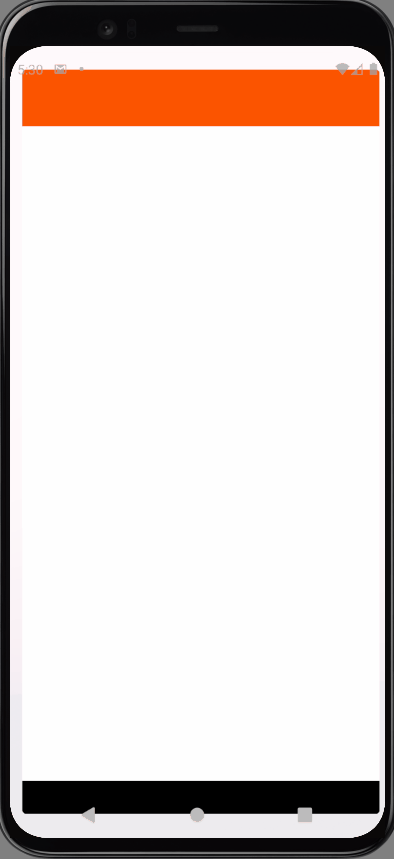
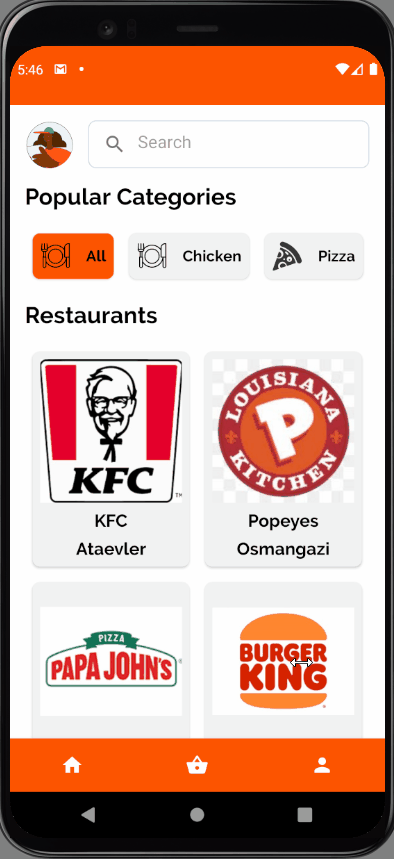
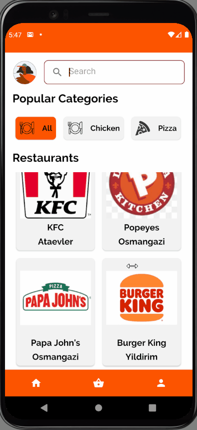
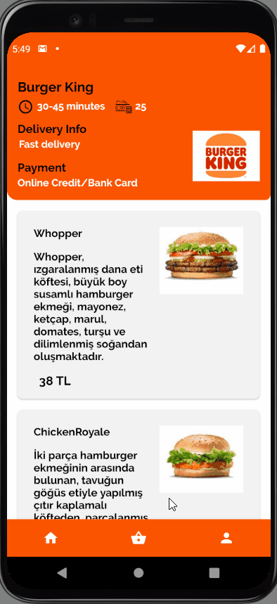
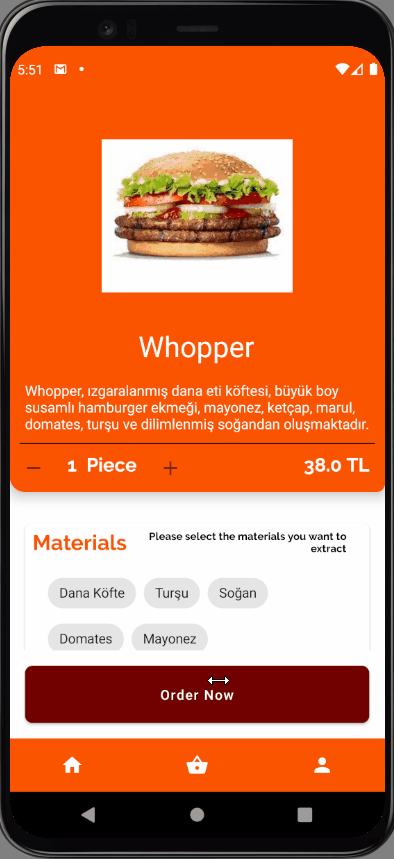
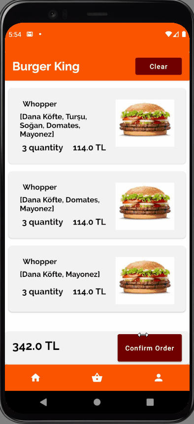
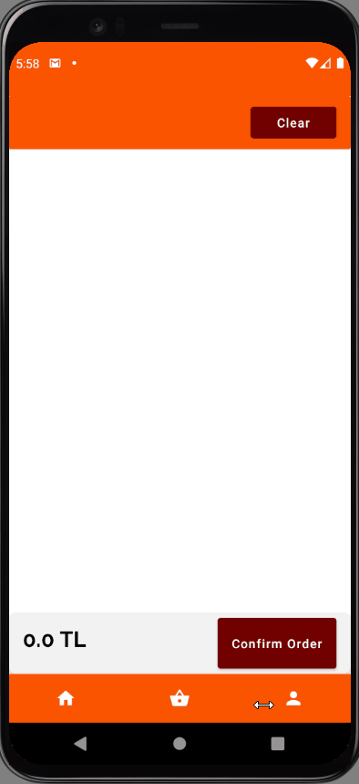
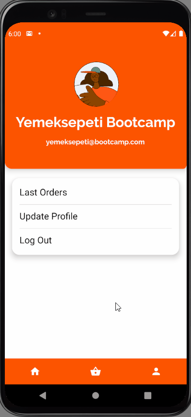
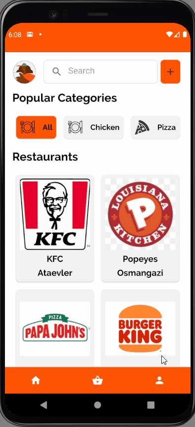
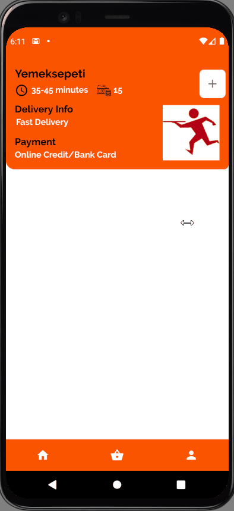

# Yemeksepeti Mobile Android Bootcamp Graduation Project.

## About this project

This project is a simple food ordering application. I learned the most used libraries and structures in android applications, in this project

## Used Technologies

* MVVM Architecture
* Retrofit, okHttp
* Dagger Hilt
* Kotlin Coroutine
* ViewModel - LiveData
* Gson
* Lottie Animations
* RecyclerView
* Fragments
* Room

## Project Structure
------
* Splash Screen
* Onboarding Screens
* Login Screen
* Home Screen
* Restaurant Detail Screen
* Meal Detail Screen
* Order Card Screen
* Profile Screen
* Update User Screen
* Last Orders Screen
* Add Restaurant Screen
* Add Meal Screen

### Screen Usage
-----

#### Splash, Onboarding, Login Screens
-----

#### Home Screen
-----

* Restaurant List
* Restaurants can be search by name and district
* Restaurants can be filtered by category

#### Restaurant Detail Screen
-----

* Minimum Restaurant Info
* Meal List

#### Meal Detail Screen
-----

#### Order Card Screen
-----

* Orders are added according to materials. If there is an order with the same materials, the quantity is increased.
* Clear button cleans the order card

#### Profile, Update User, Last Orders Screens
-----

#### Add Restaurant, Add Meal Screens
-----

* Add button only appears for admin users

